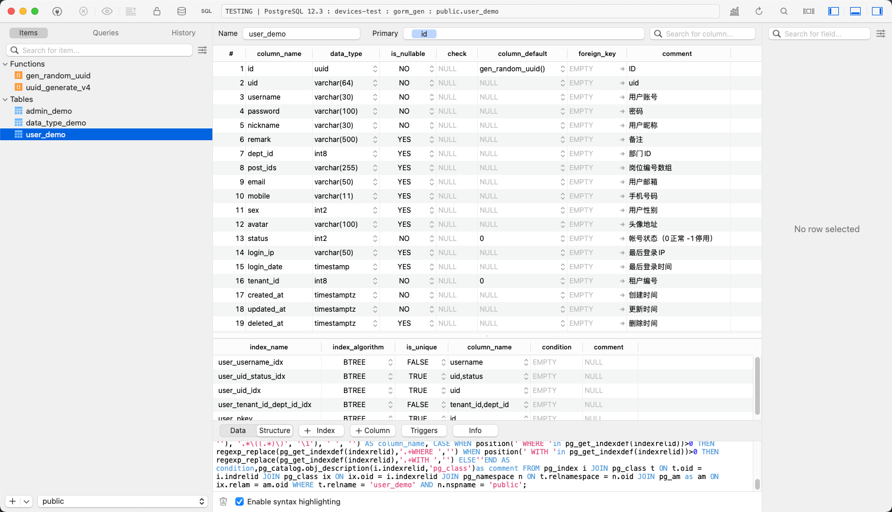
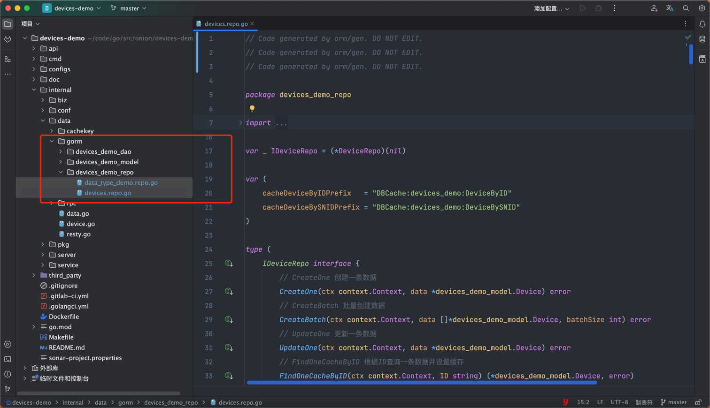
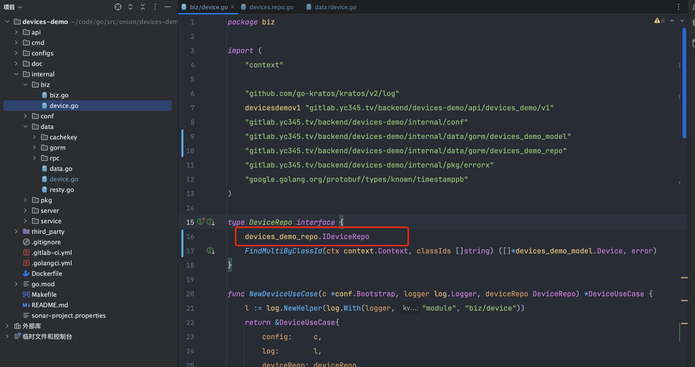
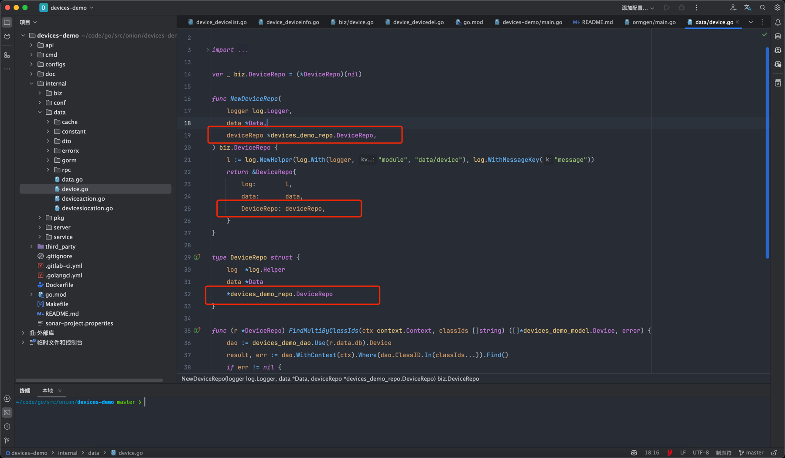
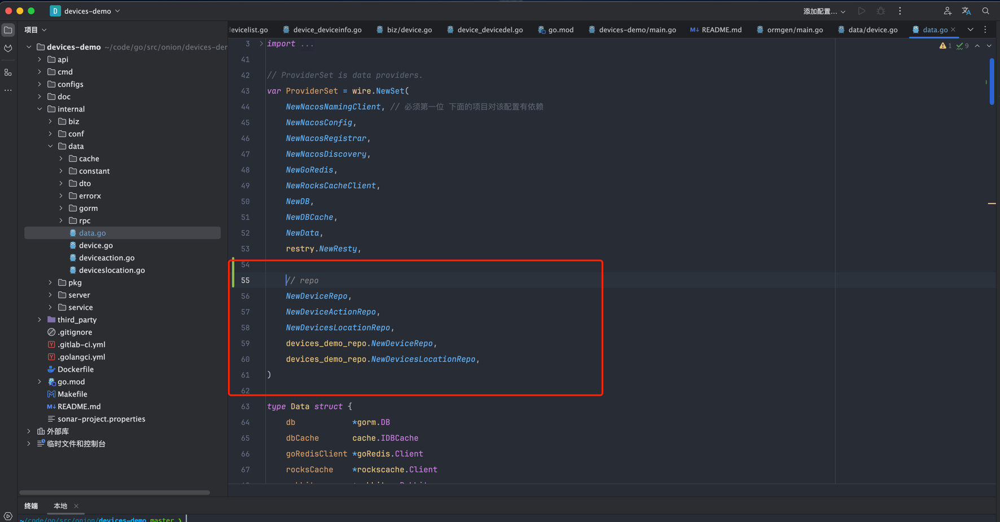
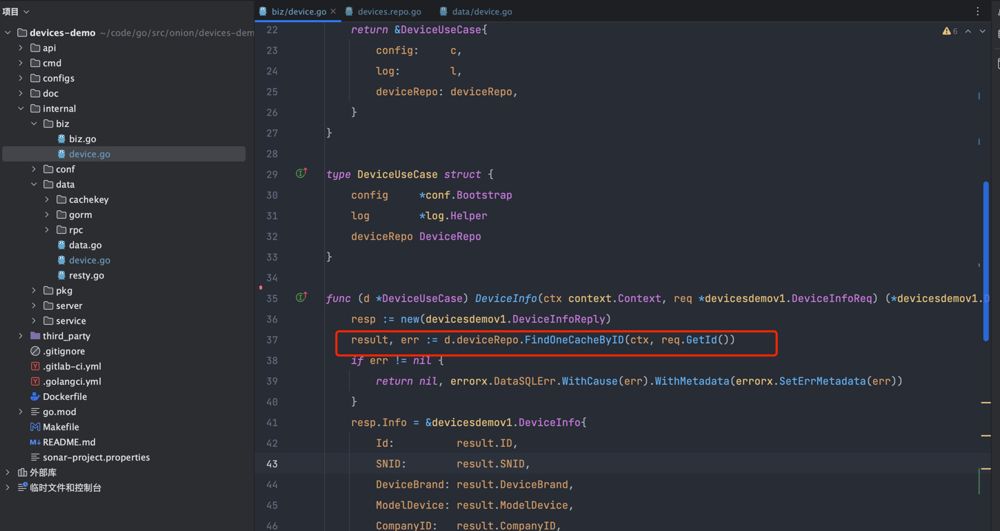
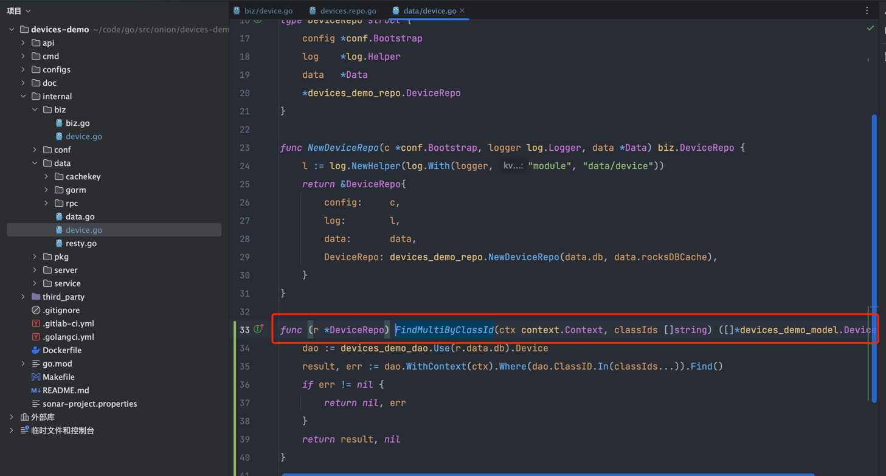

# orm/gen

## 简述
`orm/gen`是一个通过数据库表结构生成Go代码的工具。目前有两种工具，`GORM代码生成`和 `proto代码`生成。
- `GORM代码生成`:根据表结构自动生成`model`,`dao`,`repo`代码并内置查询缓存功能，简化数据库操作与缓存的开发工作。
- `proto代码生成`:根据表结构生成包含基本的 CURD方法的 pb 文件，提升编写 pb 文件的效率。

## 功能特点
- 按gorm/gen的方式自动生成代码
- 可自定义数据表命名规则和字段映射规则
- 根据表索引构建CURD方法
- 根据表中主键索引和唯一索引生成查询缓存方法
- 根据表结构生成proto文件

## 使用方法
### 通用示例(可自行引入到你的项目中)
```go
	// 初始化数据库
	db, err := orm.NewDBWithStruct(&orm.ORMConfig{
		User:     "postgres",
		Password: "7to12pg12",
		Host:     "10.8.8.110",
		Port:     5433,
		DBname:   "gorm_gen",
	})
	if err != nil {
		return
	}
	// 生成代码
	NewGenerationDB(
		db.Client,
		"./example/postgres/",
		WithGenerateModel(func(g *gen.Generator) map[string]any { // 设置表关联关系(1对多,多对多...)
			adminLogDemo := g.GenerateModel("admin_log_demo")
			AdminRoleDemo := g.GenerateModel("admin_role_demo",
				gen.FieldRelate(field.Many2Many, "Admins", g.GenerateModel("admin_demo"),
					&field.RelateConfig{
						RelateSlicePointer: true,
						JSONTag:            JSONTagNameStrategy("Admins"),
						GORMTag:            field.GormTag{"joinForeignKey": []string{"role_id"}, "joinReferences": []string{"admin_id"}, "many2many": []string{"admin_to_role_demo"}},
					},
				),
			)
			adminDemo := g.GenerateModel("admin_demo",
				gen.FieldRelate(field.HasMany, "AdminLogDemos", adminLogDemo,
					&field.RelateConfig{
						RelateSlicePointer: true,
						JSONTag:            JSONTagNameStrategy("AdminLogDemos"),
						GORMTag:            field.GormTag{"foreignKey": []string{"admin_id"}},
					},
				),
				gen.FieldRelate(field.Many2Many, "AdminRoles", AdminRoleDemo,
					&field.RelateConfig{
						RelateSlicePointer: true,
						JSONTag:            JSONTagNameStrategy("AdminRoles"),
						GORMTag:            field.GormTag{"joinForeignKey": []string{"admin_id"}, "joinReferences": []string{"role_id"}, "many2many": []string{"admin_to_role_demo"}},
					},
				),
			)
			return map[string]any{
				"admin_demo":      adminDemo,
				"admin_log_demo":  adminLogDemo,
				"admin_role_demo": AdminRoleDemo,
			}
		}),
		WithDataMap(DataTypeMap()), // 设置数据类型映射
		WithDBOpts(ModelOptionRemoveDefault(), ModelOptionUnderline("UL")), // 设置自定义选项
	).Do()
```
### 洋葱Kratos项目中使用
1.安装洋葱涡轮加速工具`gitlab.yc345.tv/backend/yc_turbo_kit`，版本跟随 utils 版本
```shell
go install gitlab.yc345.tv/backend/yc_turbo_kit@latest
```
2.`makefile`文件新增以下代码:
```shell
YC_TURBO_KIT_INSTALLED := $(shell command -v yc_turbo_kit 2> /dev/null)

.PHONY: ycTurboKitCheck
# 效率工具安装检查
ycTurboKitCheck:
	@if [ -z "$(YC_TURBO_KIT_INSTALLED)" ]; then \
  		echo "try to install yc_turbo_kit: https://gitlab.yc345.tv/backend/yc_turbo_kit"; \
  	   	go install gitlab.yc345.tv/backend/yc_turbo_kit@latest; \
    fi

.PHONY: gorm
# 生成 GORM 数据库代码
gorm:ycTurboKitCheck
	@yc_turbo_kit ormgen
```
3.数据库创建表，编写注释及索引（注意：唯一类索引会生成查询缓存，注释不要少！注释不要少！注释不要少！）


4.项目根目录执行`make gorm`命令,生成代码.


5.在biz层引入repo到interface中


6.在data中引入生成好的repo结构体


7.在data中依赖注入repo初始化函数


8.在biz中使用生成好的查询方法.


9.若生成的方法中不满足需求,需要新增方法则按照kratos的方式在repo新增方法,在data中实现即可.


注意：该方法只是一种举例，不是强制要求，并且只支持基本功能，例如对于表关联关系的需求可使用通用示例。

## 查询示例
参考:
```go
orm/gen/example/example_test.go
```


## 业界方案
### go-zero：
- 地址：[https://go-zero.dev/docs/tutorials/mysql/cache](https://go-zero.dev/docs/tutorials/mysql/cache)
- 实现方式：框架自行实现了ORM和Cache库，可通过数据库表结构生成数据库CURD代码和缓存代码。SQL是手动拼装的模式编写。缓存策略是先更新后删除缓存。

### go-frame：
- 地址：[https://goframe.org/pages/viewpage.action?pageId=1114346](https://goframe.org/pages/viewpage.action?pageId=1114346)
- 实现方式：框架自行实现了ORM和Cache库，仅支持链式操作，在事务操作下不可用。在写SQL的时候会使用一个缓存方法，把当前查询的数据缓存进去。

### gorm-cache：
- 地址：[https://github.com/go-gorm/caches](https://github.com/go-gorm/caches)
- 实现方式：官方gorm的插件，抽象了一个缓存接口，目前该插件不保证缓存和数据库之间的一致性。

### sponge：
- 地址：[https://github.com/zhufuyi/sponge/blob/main/assets/readme-cn.md](https://github.com/zhufuyi/sponge/blob/main/assets/readme-cn.md)
- 实现方式：基于gorm，使用主键ID做缓存。

## 常见问题

* 是否支持其他数据库类型？ 
  - gorm本身支持多种数据库，在orm-gen中理论上同样支持gorm所支持的数据库,但是目前只适配了PostgreSQL.

* 为什么使用主键索引和唯一索引生成查询缓存？ 
  - 主键索引和唯一索引能保证数据的唯一性.

* 为什么查询缓存中的Cache是一个接口类型？ 
  - 将缓存抽象为接口,是为了与具体的缓存实现解耦,您可以自行更换缓存实现,例:Redis,Memcached,本地缓存等.
